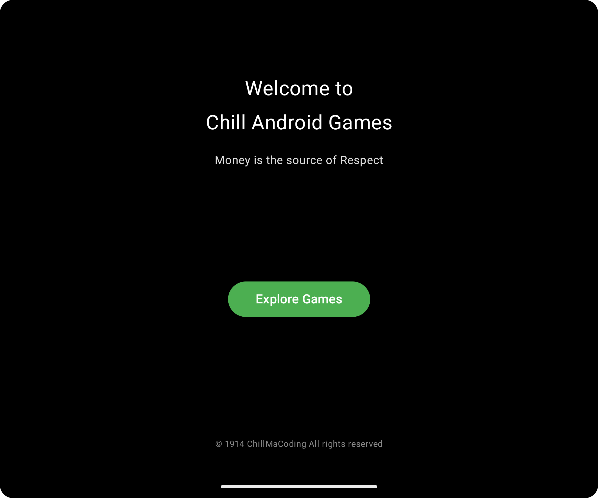
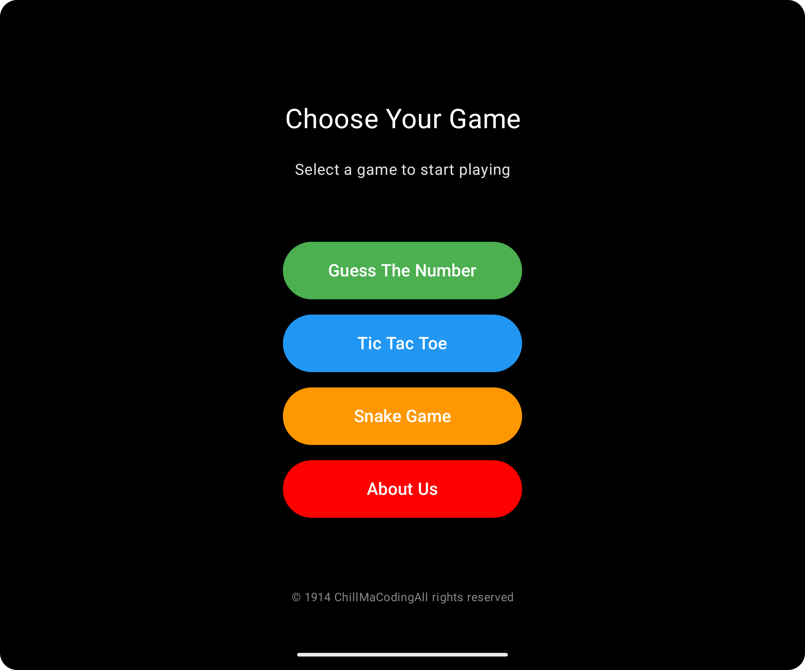
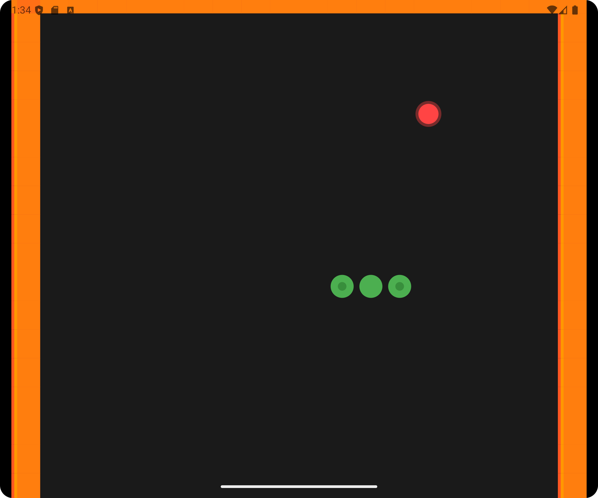
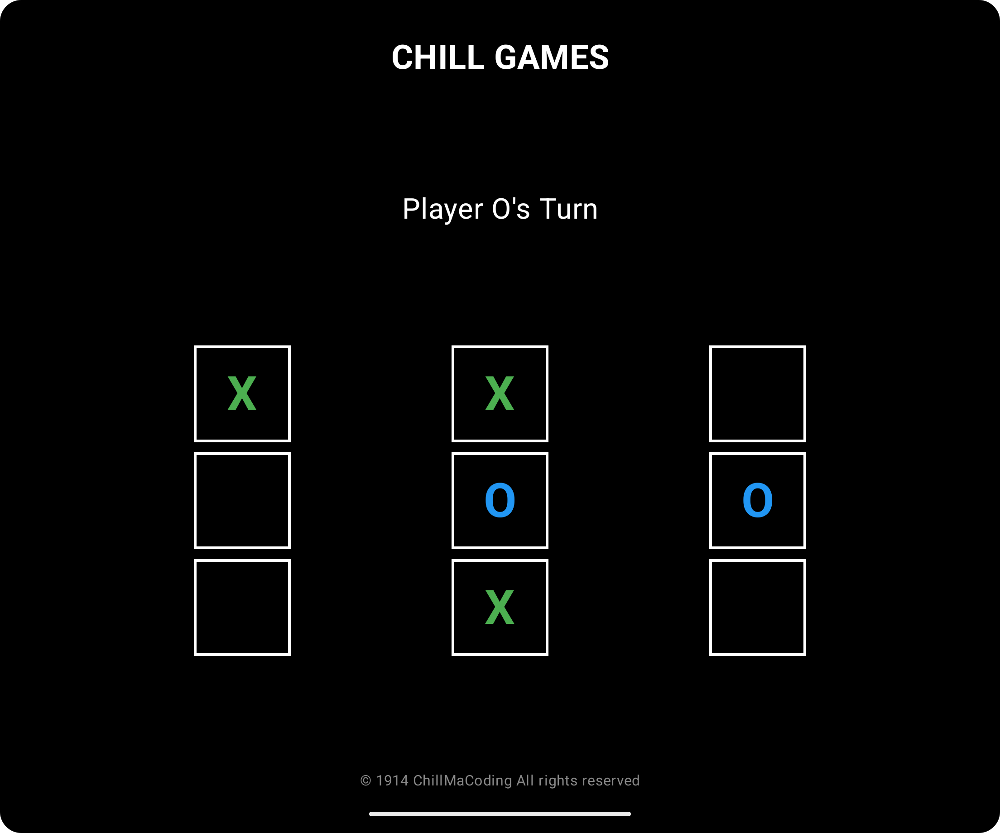
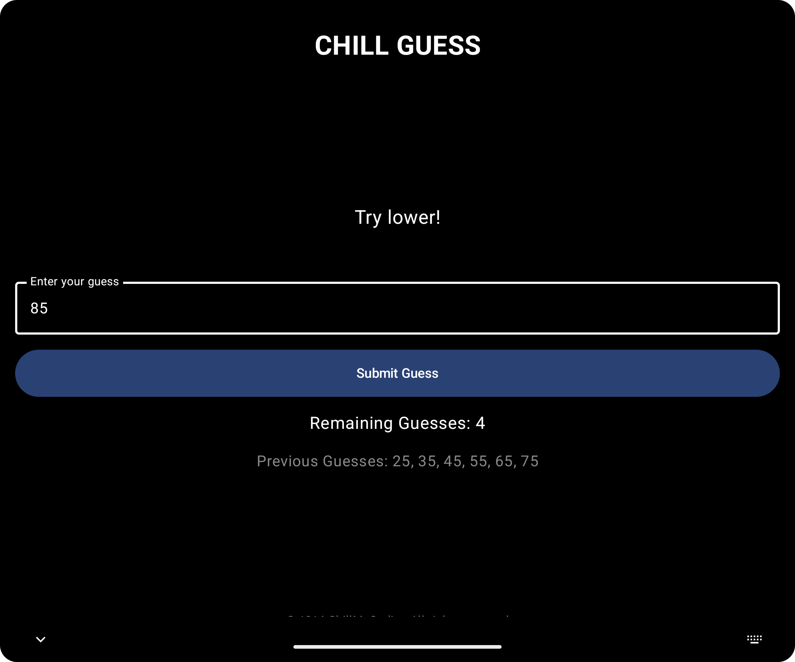

# 🎮 Chill-Android-Games  

### 🕹 One App, Multiple Offline Games!  

Chill-Android-Games is an all-in-one Android app featuring a collection of fun, lightweight, and engaging offline games like **Tic-Tac-Toe, Snakes, Guess the Number, and more**. Play anytime, anywhere—no internet required!  

---

## 📸 Screenshots  

| Home Screen | Tic-Tac-Toe | Snakes |
|------------|------------|------------|
|  |  |  |

| Guess the Number | Settings | More Games |
|-----------------|------------|------------|
|  |  |  |

---

## 🚀 Features  
✔ **Multiple Games in One App** – Play Tic-Tac-Toe, Snakes, Guess the Number, and more.  
✔ **Offline Play** – No internet? No problem! Enjoy games anytime.  
✔ **Smooth & Lightweight** – Designed for performance and minimal battery usage.  
✔ **Easy to Use** – Simple UI, intuitive gameplay, and fun for all ages.  

---

## 🔧 Tech Stack  
- **Android (Kotlin/Java)**  
- **Jetpack Components**  
- **MVVM Architecture**  
- **Custom Animations & UI**  

---

## 🛠 Installation  

### **Clone the Repository**  
```sh
git clone https://github.com/your-username/Chill-Android-Games.git
cd Chill-Android-Games
